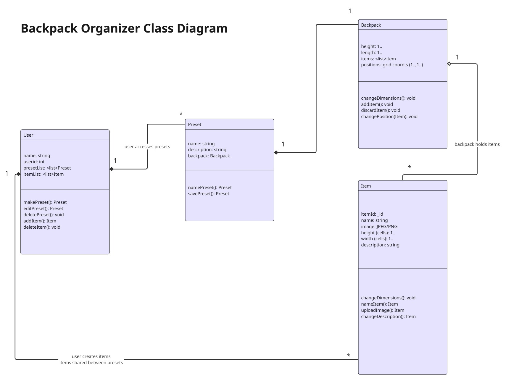

### Backpack Organizer

This project is a visual backpack organizer based on the inventory management system of Resident Evil 4. Users log in and create items in their account, which they can then put into their "backpack" grid. Users can save a backpack as a "preset", which they can access and edit.

### Project Structure

- `packages/frontend`: React frontend
- `packages/backend`: Express backend

### Code Style

We use ESLint to check for code quality issues and Prettier to keep formatting consistent.

Before pushing code, run:

```bash
npm run lint
npm run format:check
```

## Development Environment Setup

Follow these steps to run the project locally.

### 1. Clone the Repository

```bash
git clone https://github.com/csc-307-221-org/307_group_proj.git
cd 307_group_proj
```

### 2. Install Dependencies

Install dependencies from the root of the project:

```bash
npm install
```

If dependencies are managed separately in each package, run:

```bash
cd packages/frontend
npm install

cd ../backend
npm install
```

### 3. Set Up Environment Variables

Create a `.env` file in the backend folder:

```bash
cd packages/backend
touch .env
```

Add the required backend environment variables:

```env
MONGODB_URI=your_mongodb_connection_string
JWT_SECRET=your_jwt_secret
PORT=3000
```

Replace `your_mongodb_connection_string` and `your_jwt_secret` with your actual local development values.

### 4. Run the Backend

From the backend folder:

```bash
npm run dev
```

The backend should start on the port listed in the `.env` file.

### 5. Run the Frontend

In a separate terminal, run:

```bash
cd packages/frontend
npm run dev
```

The frontend should start locally and provide a development URL in the terminal.

### 6. Code Quality Checks

Before pushing code, run:

```bash
npm run lint
npm run format:check
```

### Visual Studio Code Plugins

Download ESLint and Prettier - Code formatter
Create .vscode/settings.json in the root with the contents

```json
{
  "editor.formatOnSave": true,
  "editor.defaultFormatter": "esbenp.prettier-vscode",

  "editor.codeActionsOnSave": {
    "source.fixAll.eslint": "explicit"
  },

  "eslint.validate": [
    "javascript",
    "javascriptreact"
  ],

  "eslint.workingDirectories": [
    { "mode": "auto" }
  ]
}
```

## UML Class Diagram



## UI Prototype

Our UI prototype shows the main flow of the Backpack Organizer application. The user can log in, view their backpack grid, create items, place items into the backpack, and save backpack layouts as presets.

The prototype includes the following screens:

* **Login / Sign-Up Page**: Allows users to create an account or log in.
* **Backpack Grid Page**: Displays the user’s backpack inventory as a grid.
* **Create Item Form**: Lets users create custom items with a name, size, and other item details.
* **Preset Management Page**: Allows users to save, view, edit, and reuse backpack presets.

Prototype link :
https://www.figma.com/design/Uox1TJFDsIvN67qbJYVs3F/Backpack-Wireframe?node-id=0-1&p=f&t=a3Yd5oRb5VIHW1PG-0


## Access Control Sequence Diagrams

### Sign-Up Flow

```mermaid
sequenceDiagram
    participant User
    participant Frontend
    participant Backend
    participant Database

    User->>Frontend: Enter username and password
    Frontend->>Backend: POST /signup
    Backend->>Backend: Hash password with bcrypt
    Backend->>Database: Store username and hashed password
    Database-->>Backend: User saved
    Backend->>Backend: Generate JWT token
    Backend-->>Frontend: Send token
    Frontend->>Frontend: Save token in state
    Frontend-->>User: Show signup success message
