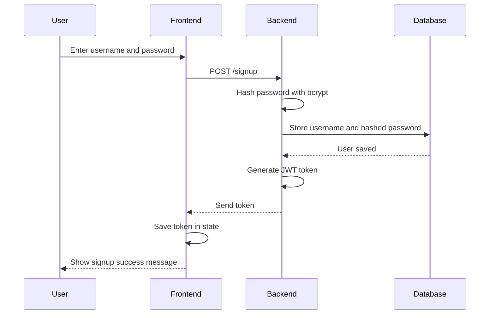

### Project Structure

- `packages/frontend`: React frontend
- `packages/backend`: Express backend

### Code Style

We use ESLint to check for code quality issues and Prettier to keep formatting consistent.

Before pushing code, run:

```bash
npm run lint
npm run format:check
```

### Visual Studio Code Plugins

Download ESLint and Prettier - Code formatter
Create .vscode/settings.json in the root with the contents

```json
{
  "editor.formatOnSave": true,
  "editor.defaultFormatter": "esbenp.prettier-vscode",

  "editor.codeActionsOnSave": {
    "source.fixAll.eslint": "explicit"
  },

  "eslint.validate": ["javascript", "javascriptreact"],

  "eslint.workingDirectories": [{ "mode": "auto" }]
}
```

## Authentication System

The application uses JWT-based authentication with bcrypt password hashing.

Features implemented:

- User signup
- User login
- Password hashing using bcrypt
- JWT token generation
- Protected backend routes
- Frontend login and signup pages
- Authorization header verification

---

## Access Control Sequence Diagrams

### Sign-Up Flow


